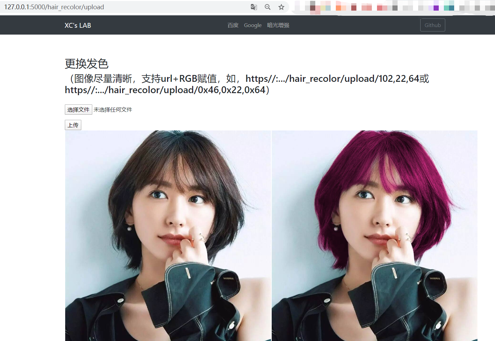

# U-Net发型分割及染发

url传参支持10/16进制的RGB赋值操作

* 模型路径:src/weights.002.h5或src/weights.005.h5

## 使用
1、运行web端服务:在`src`目录下运行`python3 web_api_hair_recolor.py`

2、打开浏览器:

默认参数：

http://127.0.0.1:5000/hair_recolor/upload

url 中文传参：

http://127.0.0.1:5000/hair_recolor/upload/银色

url RGB赋值传参：

http://127.0.0.1:5000/hair_recolor/upload/20,30,60  

## 备注

> 20,30,60为对应RGB值；
> 
> 可以使用的中文参数如下，可以在`src/web_api_hair_recolor.py`做修改和增删；
> 
            '银色':     [169, 169, 169],
            '皇家蓝':   [65, 105,  225],
            '紫色':     [128, 0,   128],
            '浅粉':     [255, 182, 193],
            '深粉':     [255, 20,  147],
            '巧克力':   [210, 105,  30],
            '森林绿':   [34,  139,  34]
            
> 默认颜色：RGB(102, 22, 64)

## 结果展示

